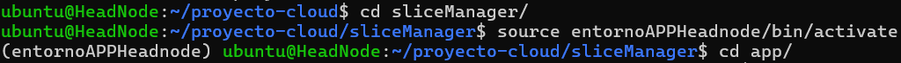
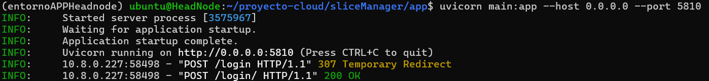
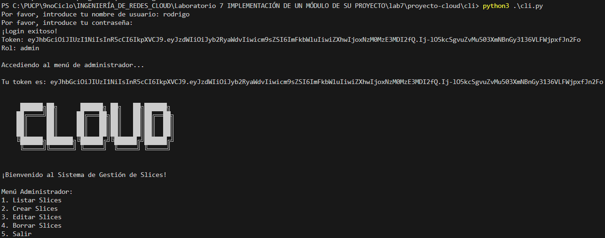

# proyecto-cloud

CloudPUCP: Automated Private Cloud Management System

RESUMEN DEL PROYECTO 

Visión: El proyecto busca desarrollar un orquestador de nube privada para la Pontificia Universidad Católica del Perú (PUCP) utilizando servidores DELL PowerEdge R720. El objetivo es permitir la creación dinámica de topologías de máquinas virtuales (VMs) conectadas en capa 2, con un enfoque en automatizar el aprovisionamiento y la gestión de los recursos, minimizando el riesgo de error humano. Esta solución será la primera versión de un sistema sin entorno gráfico que facilite al administrador de la infraestructura el despliegue y gestión de las VMs.

Alcance del Proyecto: El sistema propuesto debe cubrir una variedad de funciones críticas, como controlar la creación y eliminación de "slices" (grupos de VMs), orquestar la asignación de VMs a servidores físicos, y proveer soporte tanto para clusters de servidores Linux como para OpenStack. Además, debe garantizar el networking en capas 2 y 3 con reglas de seguridad cibersegura, permitiendo la gestión eficiente de los recursos en la nube

INSTALACIÓN 

Para poder probar el proyecto se debe de conectar al headnode donde estan el mismo proyecto pero con los archivos necesarios para poder recibir los difrentes usuarios que se registran
Lo primero que se tiene que realizar es la activacion del entorno en el nivel de ubuntu@HeadNode:~/proyecto-cloud/sliceManager$ source entornoAPPHeadnode/bin/activate

Luego de obtner todo esto se debe de ir directorio de app de Slice Manager, en donde debemos de activar el uvicorn, (entornoAPPHeadnode) ubuntu@HeadNode:~/proyecto-cloud/sliceManager/app$ uvicorn main:app --host 0.0.0.0 --port 5810, asi podemos habilitar el servidor

Finalmente ahora si se puede realizar la ejecución el codigo desde el terminal, en este caso el que realiza la inicialización de todo el codigo es el cli.py 

Aqui es donde ya puede empezar a usar el código. 

